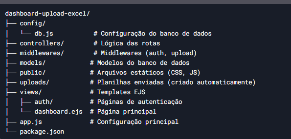

Dashboard de Upload de Planilhas 📊

# Dashboard de Upload de Planilhas Excel

Sistema web para upload e validação de planilhas Excel (XLS/XLSX) com autenticação de usuários e dashboard administrativo.

## ✨ Funcionalidades
- **Autenticação segura** (login, registro, recuperação de senha)
- **Upload de planilhas** com validação de campos obrigatórios
- **Processamento inteligente** de dados (CNPJ, CPF, campos textuais)
- **Relatório detalhado** de registros válidos/inválidos
- **Interface responsiva** com Bootstrap 5

## 🛠️ Tecnologias
- **Backend**: Node.js + Express
- **Banco de Dados**: MySQL
- **Autenticação**: Bcrypt + Sessions
- **Processamento de Excel**: Biblioteca `xlsx`
- **Frontend**: EJS + Bootstrap 5

## ⚙️ Pré-requisitos
- Node.js v16+
- MySQL 8+
- NPM/Yarn

## 🚀 Como Executar
1. Clone o repositório:

   git clone https://github.com/Macspc/dashboard-upload-excel.git
   
   cd dashboard-upload-excel

Instale as dependências:

npm install

Configure o banco de dados:

Execute o script SQL em database/schema.sql

Edite as credenciais no arquivo config/db.js

Inicie o servidor:

npm start

Acesse: http://localhost:3000/login

📌 Estrutura de Arquivos

🔐 Credenciais Padrão

Admin: admin@exemplo.com / senha123

(Voce tambem pode cadastrar um usuario na tela de login!)

📊 Processamento de Planilhas

O sistema valida:

Campos obrigatórios

Formato de CNPJ/CPF

Tipos de dados

Estrutura da planilha

Exemplo de saída:

json
Copy
{
  "nomeArquivo": "clientes.xlsx",
  "totalRegistros": 150,
  "registrosValidos": 142,
  "registrosInvalidos": 8,
  "problemasDetectados": {
    "camposVazios": {"cnpj": 3},
    "formatosInvalidos": {"cpf": 5}
  }
}
🌐 Rotas Principais
Rota	Descrição
/	Redireciona para login/dashboard
/login	Página de login
/register	Página de registro
/dashboard	Área logada (upload de arquivos)
/upload	Endpoint para upload (POST)
📝 Licença
MIT License - Consulte o arquivo LICENSE para detalhes.

Nota para Desenvolvedores: Para configurar o envio de emails reais na recuperação de senha, edite as configurações em config/mail.js.

### 💡 Para Personalização:
1. Substitua as imagens de placeholder por screenshots reais
2. Adicione um diagrama de arquitetura (se relevante)
3. Inclua um guia de contribuição (para projetos open-source)
4. Adicione badges do Travis CI/Codecov (se tiver testes)

Macspc System - Caçapava - 2025

